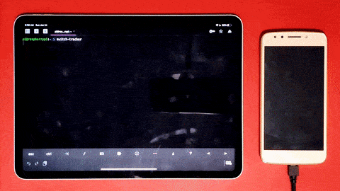

# switch-tracker

**Extract switch playtime from the Switch Parental Controls Android app**

Nintendo allows switch owners to track their gaming time using the Switch Parental Control app, but no API is available to access that data. This library extracts that data by controlling a developer enabled android device, using the ADB (Android Debug Bridge) command line tool.

See it in action:



This library was tested on a Raspberry Pi and on macOS

# Requirements

* [Node.js](https://nodejs.org/)
* [ADB](https://developer.android.com/studio/releases/platform-tools)

# Installation

`npm install switch-tracker`

# Usage

## Terminal command

```bash
$ switch-tracker
```

## Node.js

```ts
import { getSwitchPlayTime } from 'switch-tracker'

async function printPlayTime() {
    const playTime = await getSwitchPlayTime()
    console.log(playTime)
}

printPlayTime()
```

## Example output:

```json
[
  {
    "dateString": "Today",
    "weekday": "Su",
    "minutes": 0,
    "index": 0,
    "date": "2021-01-24"
  },
  {
    "dateString": "Yesterday",
    "weekday": "Sa",
    "minutes": 110,
    "index": 1,
    "date": "2021-01-23"
  },
  {
    "dateString": "22",
    "weekday": "Fr",
    "minutes": 0,
    "index": 2,
    "date": "2021-01-22"
  },
  /* ... */
]
```

## Options


### Descriptions:

* `pages`: Number scrolls down the list of days, determines how many days are parsed
* `xmlFile`: Temporary XML file path with the android UI information. _**Note:**_ Probably doesn't need to be changed

### Examples:

#### cli:

```bash
$ switch-tracker --pages 6 --xml-file ./android-ui.xml
```

#### code:

```js
const playTime = await getSwitchPlayTime({
    pages: 6,
    xmlFile: "./android-ui.xml"
})
```

### Specifications:

| json field | cli             | type          | default                 |
| ---------- | --------------- | ------------- | ----------------------- |
| `pages`    | `-p --pages`    | number        | 4                       |
| `xmlFile`  | `-f --xml-file` | string (path) | `switch-tracker/ui.xml` |

# Troubleshooting

* `Error: Command failed: adb shell uiautomator dump`:
   *  This is a known transient error, killing the app manually and giving it some time before trying it again should fix it
* Please submit an issue if you run into anything else!  

# Development

Exiting features and some ideas for new ones:

- [x] extract play time for each day
- [x] cli tool
- [ ] handle transient errors
- [ ] add option to specify how many days to extract instead of specifying times to scroll
- [ ] get games played that day
- [ ] use nintendo's api directly instead of controlling an android device (see [switchpub](https://github.com/cleverdevil/switchpub))

If you have any problems or suggestions, please open an issue or submit a pull request!

# License

MIT License
